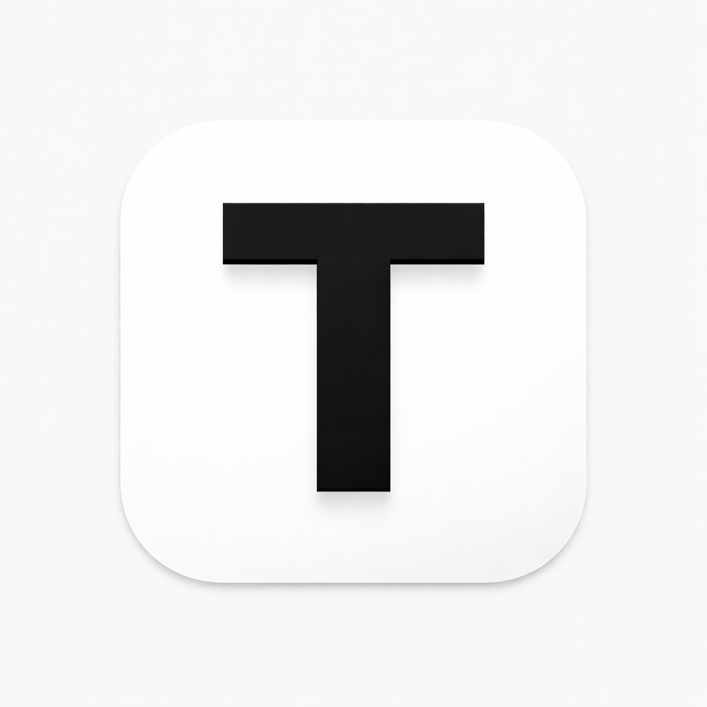
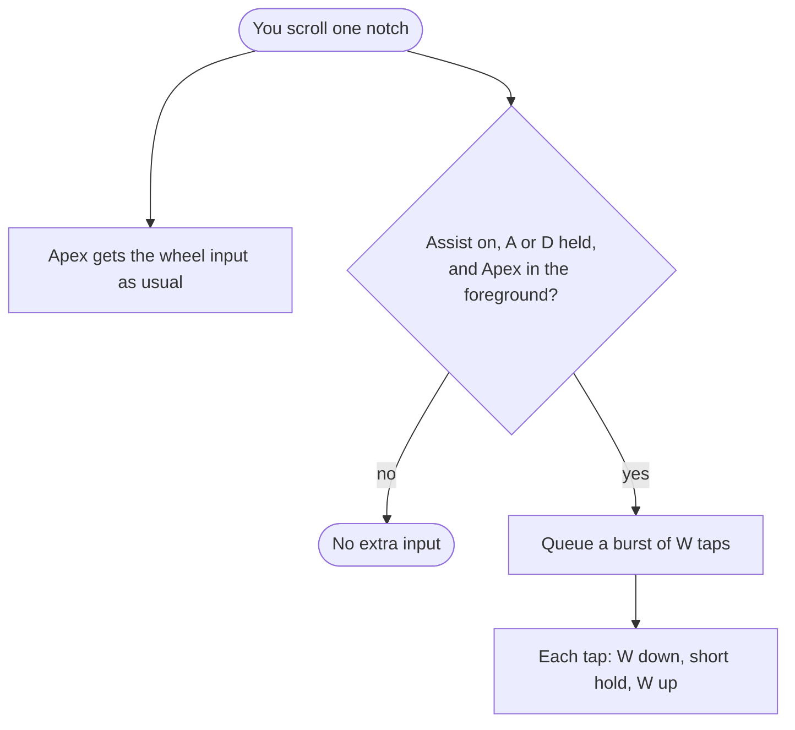

<p align="center">
  
</p>

<h1 align="center">Tapper</h1>

<p align="center">
  A small Windows tray app that turns your mouse wheel into a tap-strafe helper for Apex Legends.
</p>

<p align="center">
  <a href="https://github.com/Riqqqque/Tapper/releases/latest"></a>
  
  
  <a href="https://github.com/Riqqqque/Tapper/blob/main/LICENSE"></a>
</p>

---

Tap-strafing in Apex means rapidly tapping forward (`W`) in the air while holding a strafe key and turning, which lets you redirect your momentum sharply. Tapper makes your scroll wheel supply those taps for you: every wheel notch you scroll while holding `A` or `D` also sends a short burst of `W` taps to the game.

Your wheel input still reaches Apex untouched, so a jump bind on the wheel keeps working exactly as before. Tapper only adds the forward taps.

- **Native and tiny.** One ~800 KB Rust executable with no .NET or other runtime needed.
- **Only active in Apex.** Taps are sent only while the Apex window is in the foreground. Both the DirectX 11 (`r5apex.exe`) and DirectX 12 (`r5apex_dx12.exe`) executables are recognized.
- **Only when you strafe.** By default nothing happens unless `A` or `D` is held.
- **Stays out of the way.** It lives in the system tray, with `F8` to toggle and `Ctrl+F8` to quit.
- **No backlog.** Spinning the wheel fast never queues up more than one burst, so taps stop when you stop scrolling.

## Download and install

1. Grab the latest release from the **[Releases page](https://github.com/Riqqqque/Tapper/releases/latest)**:
   - `TapperSetup-<version>.exe`: installer (recommended)
   - `Tapper-<version>-portable.zip`: no install, unzip and run `Tapper.exe`
2. Run the installer. It installs just for your Windows account into `%LocalAppData%\Tapper` and does not need administrator rights. You can optionally add a desktop shortcut or **Run Tapper when I sign in**.
3. Tapper starts in the system tray. If you don't see the icon, check the `^` overflow area next to the clock.

> **"Windows protected your PC"?** Tapper isn't code-signed, so SmartScreen warns about it. Click **More info → Run anyway**. You can check that your download matches the release by comparing its hash with the SHA-256 listed in the release notes:
>
> ```powershell
> Get-FileHash .\TapperSetup-1.0.25.exe -Algorithm SHA256
> ```

## Set up Apex

1. In Apex, open **Settings → Mouse/Keyboard** and bind **Jump** to **Mouse Wheel Down** (and/or **Mouse Wheel Up**). You can keep `Space` in the other binding slot.
2. Leave Tapper running. The assist is on as soon as it starts.

## Using it

1. Jump and, while in the air, hold `A` or `D`.
2. Scroll the wheel and turn your mouse in the direction you want to go.
3. Each notch gives you the game's normal wheel input plus a quick burst of `W` taps (3 by default).

If you're already holding `W`, Tapper doesn't spam a burst. It briefly releases `W` and presses it again, which gives the same forward re-tap without dropping your hold. To skip the assist entirely while `W` is held, set `blockWhenForwardHeld` to `true`.

### Hotkeys

| Key | Action |
| --- | --- |
| `F8` | Turn the assist on or off |
| `Ctrl+F8` | Quit Tapper |

If another program already uses `F8` or `Ctrl+F8`, Tapper falls back to the next free pair: `F7`, `F9`, `F6`, then `F10`. Hover the tray icon to see which keys it picked. If none are free, use the tray menu instead. While Tapper is running its hotkeys are reserved, so other apps won't receive them.

### Tray menu

Left- or right-click the tray icon to see:

- **Assist status** and the **active hotkeys**
- **Open App Folder**, **Open Log**, **Open Settings**
- **Enable / Disable Assist**
- **Exit**

## How it works



- **Wheel:** Tapper listens to the mouse through Windows Raw Input. It only reads wheel events and never blocks or changes them.
- **Keys:** a low-level keyboard hook tracks whether `A`, `D` and `W` are physically held. Every other key is ignored, and nothing you type is recorded.
- **Taps:** a background thread sends the `W` presses with `SendInput` using hardware scan codes and a high-resolution timer, so each tap is held for a precise number of milliseconds.
- **Target check:** the foreground window's process name is compared with `processNames`. The window title is only used as a fallback if the process name can't be read.

Tapper does not read or modify game memory, and it never connects to the internet.

## Settings

Settings live in `tapper.settings.json` next to `Tapper.exe`. Use **Open Settings** in the tray menu to edit it.

**Restart Tapper after editing** (tray **Exit**, then launch it again), because settings are read at startup.

| Setting | Default | Range | What it does |
| --- | --- | --- | --- |
| `enabledOnStart` | `true` | | Start with the assist turned on. |
| `forwardTapHoldMs` | `6` | 1–25 | How long each injected `W` press is held down. |
| `forwardTapBurstCount` | `3` | 1–6 | How many `W` taps each wheel notch sends. |
| `forwardTapPulseGapMs` | `0` | 0–10 | Extra pause after each tap in a burst. |
| `forwardTapCooldownMs` | `0` | 0–25 | Minimum time between wheel notches that can trigger a burst. Notches inside this window are ignored. |
| `heldForwardRetapReleaseMs` | `2` | 1–10 | When you're already holding `W`, how long it's released before being pressed again. |
| `maxQueuedForwardTaps` | `24` | 1–64 | Upper limit on pending taps. The queue never grows beyond one burst anyway, so this only matters if you set it below `forwardTapBurstCount`. |
| `triggerOnWheelDown` | `true` | | Wheel-down notches trigger the assist. |
| `triggerOnWheelUp` | `true` | | Wheel-up notches trigger the assist. If both are `false`, wheel-down is turned back on. |
| `requireStrafeKey` | `true` | | Only fire while `A` or `D` is held. |
| `blockWhenForwardHeld` | `false` | | Skip the assist completely while you hold `W`, instead of re-tapping it. |
| `processNames` | `r5apex.exe`, `r5apex_dx12.exe` | | Executables that count as Apex. Both defaults are always included, and you can add more. |
| `windowTitleContains` | `Apex Legends` | | Window title fallback, used only when the process name can't be read. |

Good to know:

- Values outside the range are clamped and written back to the file.
- If the file is broken, Tapper renames it to `tapper.settings.invalid.json`, writes a fresh default config and notes it in the log, so your edits aren't thrown away.
- Files saved as UTF-8, UTF-8 with BOM, or UTF-16 (for example from Notepad) all work.
- Upgrading Tapper keeps your settings.

## Troubleshooting

**Nothing happens in game.**
Hover the tray icon and make sure the assist is **enabled**. You need to hold `A` or `D` (unless you turned off `requireStrafeKey`), and Apex has to be the active window. **Open Log** in the tray menu shows what Tapper is doing.

**Apex is running as administrator.**
Windows silently blocks input from normal apps into elevated ones. Run Tapper as administrator too, or start Apex normally.

**`F8` doesn't toggle anything.**
Another app probably owns it. Hover the tray icon to see which hotkey Tapper ended up with.

**Antivirus flags it.**
Apps that send keyboard input are a common false positive, and Tapper isn't code-signed. The full source is here, and the release notes list SHA-256 hashes for every download.

**I ran a portable copy but the installed one started instead.**
That's on purpose so you never end up with two copies fighting each other. If Tapper is installed, launching any other `Tapper.exe` starts the installed one instead. If the copy you launched is a newer version, it upgrades the installed one first (your settings are kept).

## Updating and uninstalling

- **Update:** run the newer installer. It closes the running Tapper, replaces the app files and keeps your `tapper.settings.json`.
- **Uninstall:** use **Settings → Apps → Installed apps → Tapper**, or **Uninstall Tapper** in the Start menu. The uninstaller closes Tapper first and removes its settings and log.

## Building from source

You need Windows 10/11 x64 with:

- [Rust](https://rustup.rs/) 1.88 or newer, stable, using the MSVC toolchain
- Visual Studio Build Tools with the C++ workload, which Rust needs for linking
- [Inno Setup 6](https://jrsoftware.org/isinfo.php), only if you want to build the installer

```powershell
cargo test
cargo build --release      # target\release\Tapper.exe
```

To build everything for a release, run:

```powershell
powershell -ExecutionPolicy Bypass -File scripts\build-installer.ps1
```

That writes `installer-dist\TapperSetup-<version>.exe` and `installer-dist\Tapper-<version>-portable.zip`, refreshes `dist\`, and prints SHA-256 hashes for the release notes. The version comes from `Cargo.toml`.

> **Heads-up for development:** if Tapper is installed on the same PC, launching a build with a higher version number upgrades the installed copy, and launching one with the same or a lower version just starts the installed copy. Uninstall first, or keep the version in `Cargo.toml` unchanged, while you test locally.

### Project layout

| Path | Contents |
| --- | --- |
| `src/main.rs` | The whole app: tray, hotkeys, raw input, keyboard hook, tap worker, settings, self-update |
| `build.rs` | Embeds the icon and version info into the exe |
| `tapper.settings.json` | Default settings shipped with each build |
| `installer/installer.iss` | Inno Setup script |
| `scripts/build-installer.ps1` | Release build and packaging |
| `assets/` | App icon and logo |

## Disclaimer

Tapper is an unofficial fan project and is not affiliated with or endorsed by Electronic Arts or Respawn Entertainment. It sends synthetic keyboard input to the game. Games and their anti-cheat systems can treat input automation as a rules violation, so check the current rules for Apex Legends and use Tapper at your own risk.

## License

[MIT](https://github.com/Riqqqque/Tapper/blob/main/LICENSE) © Rique
